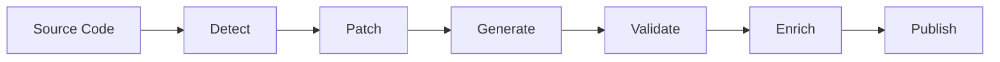

# Spec Forge

[](https://goreportcard.com/report/github.com/spencercjh/spec-forge)
[](https://godoc.org/github.com/spencercjh/spec-forge)
[](https://github.com/spencercjh/spec-forge/actions/workflows/ci.yml)
[](https://github.com/spencercjh/spec-forge/actions/workflows/copilot-pull-request-reviewer/copilot-pull-request-reviewer)
[](https://github.com/spencercjh/spec-forge/actions/workflows/dependabot/dependabot-updates)

A CLI tool that generates enriched OpenAPI specifications from source code using AI.

## Features

- 🔍 **Auto-detection** - Automatically detects project type and build tools
- 🔧 **Auto-patching** - Adds required dependencies and plugins if missing
- 🤖 **AI Enrichment** - Uses LLM to generate meaningful descriptions for APIs and schemas
- 🌐 **Multi-provider** - Supports OpenAI, Anthropic, Ollama, and custom providers

## How It Works



1. **Detect** - Identifies project type, build tool, and required dependencies
2. **Patch** - Adds dependencies if missing, configures plugins
3. **Generate** - Runs build tool to generate OpenAPI spec
4. **Validate** - Validates the generated OpenAPI specification
5. **Enrich** - Uses LLM to add descriptions to APIs, parameters, and schemas
6. **Publish** - Writes the final spec to local file or publishes to documentation platforms

## Installation

```bash
go install github.com/spencercjh/spec-forge@latest
```

## Quick Start

```bash
# Generate OpenAPI spec from a Spring Boot project
spec-forge generate ./path/to/spring-boot-project

# Generate with AI enrichment
LLM_API_KEY="your-api-key" spec-forge generate ./path/to/spring-boot-project \
    --enrich --provider openai --model gpt-4o --language en

# Enrich an existing OpenAPI spec
LLM_API_KEY="your-api-key" spec-forge enrich ./openapi.json \
    --provider openai --model gpt-4o --language zh
```

## Configuration

Create `.spec-forge.yaml` in your project root:

```yaml
enrich:
  enabled: true
  provider: custom
  model: deepseek-chat
  baseUrl: https://api.deepseek.com/v1
  apiKeyEnv: LLM_API_KEY
  language: zh
  timeout: 60s

output:
  dir: ./openapi
  format: yaml
```

**Configuration priority:** `flag > env > config file > default`

## Supported LLM Providers

| Provider    | API Key Env         |
|-------------|---------------------|
| `openai`    | `OPENAI_API_KEY`    |
| `anthropic` | `ANTHROPIC_API_KEY` |
| `ollama`    | -                   |
| `custom`    | `LLM_API_KEY`       |

```bash
# Custom provider example (DeepSeek)
LLM_API_KEY="sk-xxx" spec-forge enrich ./openapi.json \
    --provider custom \
    --custom-base-url https://api.deepseek.com/v1 \
    --model deepseek-chat
```

## Supported Frameworks

| Framework                                                                                                                                    | Language       | Status         |
|----------------------------------------------------------------------------------------------------------------------------------------------|----------------|----------------|
| [Spring Boot](https://springdoc.org/#plugins)                                                                                                | Java           | ✅ Supported    |
| [Gin](https://gin-gonic.com/)                                                                                                                | Go             | ✅ Supported    |
| [go-zero](https://go-zero.dev/reference/cli-guide/swagger/)                                                                                  | Go             | ✅ Supported    |
| [gRPC (protoc)](https://github.com/sudorandom/protoc-gen-connect-openapi)                                                                    | Multi-language | ✅ Supported    |
| [Hertz](https://github.com/hertz-contrib/swagger-generate/tree/main/protoc-gen-http-swagger)                                                 | Go             | 🚧 Coming soon |
| [Kitex](https://github.com/hertz-contrib/swagger-generate/tree/main/protoc-gen-rpc-swagger)                                                  | Go             | 🚧 Coming soon |

### gRPC Projects (Native protoc)

For gRPC projects using native protoc (not buf-managed):

```bash
# Generate OpenAPI spec from proto files
spec-forge generate ./my-grpc-project

# With additional import paths
spec-forge generate ./my-grpc-project --proto-import-path ./third_party --proto-import-path ./vendor

# Generate with AI enrichment
LLM_API_KEY="your-key" spec-forge generate ./my-grpc-project --enrich --language zh
```

**Requirements:**
- `protoc` installed ([install guide](https://github.com/protocolbuffers/protobuf/releases))
- `protoc-gen-connect-openapi` installed:
  ```bash
  go install github.com/sudorandom/protoc-gen-connect-openapi@latest
  ```

**Note:** buf-managed projects are not supported in this mode. Use `buf generate` with the plugin, then use `spec-forge enrich` on the generated OpenAPI spec.

## Supported Publishers

| Publisher                         | Status         |
|-----------------------------------|----------------|
| Local File                        | ✅ Supported    |
| [ReadMe.com](https://readme.com/) | ✅ Supported    |
| Apifox                            | 🚧 Coming soon |
| Postman                           | 🚧 Coming soon |

### Publishing to ReadMe.com

```bash
# Install rdme CLI
npm install -g rdme

# Publish to ReadMe (API key via environment variable)
README_API_KEY="rdme_xxx" spec-forge publish ./openapi.json --to readme --readme-slug my-api

# Or with full generate pipeline
README_API_KEY="rdme_xxx" spec-forge generate ./my-project --publish-target readme

## License

MIT License
