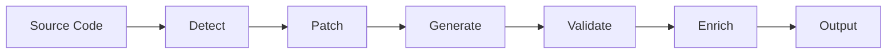

# Spec Forge

[](https://goreportcard.com/report/github.com/spencercjh/spec-forge)
[](https://godoc.org/github.com/spencercjh/spec-forge)

A CLI tool that generates enriched OpenAPI specifications from source code using AI.

## Features

- 🔍 **Auto-detection** - Automatically detects project type and build tools
- 🔧 **Auto-patching** - Adds required dependencies and plugins if missing
- 🤖 **AI Enrichment** - Uses LLM to generate meaningful descriptions for APIs and schemas
- 🌐 **Multi-provider** - Supports OpenAI, Anthropic, Ollama, and custom providers

## Installation

```bash
go install github.com/spencercjh/spec-forge@latest
```

## Quick Start

```bash
# Generate OpenAPI spec from a Spring Boot project
spec-forge generate ./path/to/spring-boot-project

# Generate with AI enrichment
LLM_API_KEY="your-api-key" spec-forge generate ./path/to/spring-boot-project \
    --enrich --provider openai --model gpt-4o --language en

# Enrich an existing OpenAPI spec
LLM_API_KEY="your-api-key" spec-forge enrich ./openapi.json \
    --provider openai --model gpt-4o --language zh
```

## Supported Frameworks

| Framework | Language | Status |
|-----------|----------|--------|
| Spring Boot | Java | ✅ Supported |
| Gin | Go | 🚧 Coming soon |
| Echo | Go | 🚧 Coming soon |

## Configuration

Create `.spec-forge.yaml` in your project root:

```yaml
enrich:
  enabled: true
  provider: custom
  model: deepseek-chat
  baseUrl: https://api.deepseek.com/v1
  apiKeyEnv: LLM_API_KEY
  language: zh
  timeout: 60s

output:
  dir: ./openapi
  format: yaml
```

**Configuration priority:** `flag > env > config file > default`

## LLM Providers

| Provider    | API Key Env         |
|-------------|---------------------|
| `openai`    | `OPENAI_API_KEY`    |
| `anthropic` | `ANTHROPIC_API_KEY` |
| `ollama`    | -                   |
| `custom`    | `LLM_API_KEY`       |

```bash
# Custom provider example (DeepSeek)
LLM_API_KEY="sk-xxx" spec-forge enrich ./openapi.json \
    --provider custom \
    --custom-base-url https://api.deepseek.com/v1 \
    --model deepseek-chat
```

## How It Works



1. **Detect** - Identifies project type, build tool, and required dependencies
2. **Patch** - Adds dependencies if missing, configures plugins
3. **Generate** - Runs build tool to generate OpenAPI spec
4. **Validate** - Validates the generated OpenAPI specification
5. **Enrich** - Uses LLM to add descriptions to APIs, parameters, and schemas
6. **Output** - Writes the final spec to disk (YAML or JSON)

## License

MIT License
