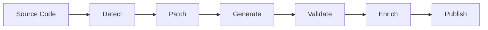

# Spec Forge

[](https://goreportcard.com/report/github.com/spencercjh/spec-forge)
[](https://godoc.org/github.com/spencercjh/spec-forge)
[](https://github.com/spencercjh/spec-forge/actions/workflows/ci.yml)
[](https://github.com/spencercjh/spec-forge/actions/workflows/copilot-pull-request-reviewer/copilot-pull-request-reviewer)
[](https://github.com/spencercjh/spec-forge/actions/workflows/dependabot/dependabot-updates)

A CLI tool that solves the fragmented, painful world of OpenAPI spec generation — auto-detects your framework, generates accurate specs from source code, and enriches them with AI.

## Why spec-forge?

Generating OpenAPI specs from backend code is harder than it should be. Every ecosystem has its own broken or half-working toolchain:

### gRPC / Protobuf

The tooling landscape is fragmented and poorly documented:

- **`google/gnostic` (`protoc-gen-openapi`)** — abandoned/unmaintained, yet still the top result in most tutorials
- **`grpc-gateway`'s `protoc-gen-openapiv2`** — only outputs Swagger 2.0, not OpenAPI 3.x
- **`buf`** — no official documentation for OpenAPI generation; developers rely entirely on third-party blog posts

Developers waste hours just figuring out which tool to use before writing a single line of code. spec-forge wraps [`protoc-gen-connect-openapi`](https://github.com/sudorandom/protoc-gen-connect-openapi) — a maintained, OpenAPI 3.x-native solution — behind a single command.

### Gin

The dominant solution ([`swaggo/swag`](https://github.com/swaggo/swag)) requires hundreds of verbose annotations:

```go
// @Summary  Get user by ID
// @Param    id   path  int  true  "User ID"
// @Success  200  {object}  User
// @Router   /users/{id} [get]
func GetUser(c *gin.Context) { ... }
```

These annotations are **not validated by the Go compiler** — typos and stale references only surface at generation time. Renaming a type means manually updating annotations everywhere.

**spec-forge requires zero annotations.** It uses Go AST analysis to read your routes, handler signatures, and struct definitions directly from source.

### Hertz / Kitex (CloudWeGo)

OpenAPI generation tools exist for both frameworks but are scattered across GitHub with no official documentation. The official CloudWeGo docs don't mention how to generate OpenAPI specs at all. spec-forge wraps this complexity into a single command (support coming soon).

### go-zero

`goctl swagger` has known bugs. spec-forge patches them internally before running generation, so you get a valid spec without manual workarounds.

---

### What about just asking an LLM to write the docs?

That's AI-generated docs — not the same thing.

spec-forge reads your **actual code structure** to guarantee accuracy, then uses AI to fill in human-readable descriptions. The result is both machine-accurate and human-readable. Docs written from scratch by an LLM drift from reality the moment your code changes.

### The AI Agent angle

In the AI Agent era, OpenAPI specs are becoming machine-readable interface contracts. Agents use them to discover and call your APIs. spec-forge helps ensure yours are accurate, complete, and always in sync with your code.

## Features

- 🔍 **Auto-detection** - Automatically detects project type and build tools
- 🔧 **Auto-patching** - Adds required dependencies and plugins if missing
- 🤖 **AI Enrichment** - Uses LLM to generate meaningful descriptions for APIs and schemas
- 🌐 **Multi-provider** - Supports OpenAI, Anthropic, Ollama, and custom providers
- ✍️ **Zero annotations for Gin** - AST-based analysis requires no `// @swagger` comments

## How It Works



1. **Detect** - Identifies project type, build tool, and required dependencies
2. **Patch** - Adds dependencies if missing, configures plugins
3. **Generate** - Runs build tool to generate OpenAPI spec
4. **Validate** - Validates the generated OpenAPI specification
5. **Enrich** - Uses LLM to add descriptions to APIs, parameters, and schemas
6. **Publish** - Writes the final spec to local file or publishes to documentation platforms

## Installation

```bash
go install github.com/spencercjh/spec-forge@latest
```

## Quick Start

```bash
# Generate OpenAPI spec from a Spring Boot project
spec-forge generate ./path/to/spring-boot-project

# Generate from a Gin project (no annotations needed — pure AST analysis)
spec-forge generate ./path/to/gin-project

# Generate from a gRPC/protoc project
spec-forge generate ./path/to/grpc-project

# Generate from a go-zero project
spec-forge generate ./path/to/go-zero-project

# Generate with AI enrichment (any framework)
LLM_API_KEY="your-api-key" spec-forge generate ./path/to/project \
    --enrich --provider openai --model gpt-4o --language en

# Enrich an existing OpenAPI spec
LLM_API_KEY="your-api-key" spec-forge enrich ./openapi.json \
    --provider openai --model gpt-4o --language zh
```

## Supported Frameworks

| Framework                                                                                                                                    | Language       | Status         |
|----------------------------------------------------------------------------------------------------------------------------------------------|----------------|----------------|
| [Spring Boot](https://springdoc.org/#plugins)                                                                                                | Java           | ✅ Supported    |
| [Gin](https://gin-gonic.com/)                                                                                                                | Go             | ✅ Supported    |
| [go-zero](https://go-zero.dev/reference/cli-guide/swagger/)                                                                                  | Go             | ✅ Supported    |
| [gRPC (protoc)](https://github.com/sudorandom/protoc-gen-connect-openapi)                                                                    | Multi-language | ✅ Supported    |
| [Hertz](https://github.com/hertz-contrib/swagger-generate/tree/main/protoc-gen-http-swagger)                                                 | Go             | 🚧 Coming soon |
| [Kitex](https://github.com/hertz-contrib/swagger-generate/tree/main/protoc-gen-rpc-swagger)                                                  | Go             | 🚧 Coming soon |

## Framework-Specific Usage

### Gin Framework

> **No annotations required.** Unlike `swaggo/swag`, which forces you to write and maintain `// @Summary`, `// @Param`, `// @Success` comments for every handler, spec-forge uses Go AST analysis to extract routes, parameters, and response types directly from your source code. There is nothing to annotate and nothing to keep in sync.

spec-forge uses static AST analysis (no runtime required):

```bash
# Basic generation from a Gin project
cd my-gin-project
spec-forge generate . -o ./openapi

# Generate with AI enrichment
LLM_API_KEY="sk-xxx" spec-forge generate . \
    --enrich \
    --provider custom \
    --model deepseek-chat \
    --language zh

# Verbose mode to see extraction details
spec-forge generate . -v
```

Supported Gin patterns:
- Direct route registration: `r.GET("/users", handler)`
- Route groups: `api := r.Group("/api")`
- Middleware chains: `r.Use(auth).GET("/protected", handler)`
- Parameter binding: `c.Param()`, `c.Query()`, `c.ShouldBindJSON()`
- Response types: extracted from `c.JSON()` calls with type inference

### gRPC Projects (Native protoc)

> **Why not `google/gnostic`, `grpc-gateway`, or `buf`?**
> - `google/gnostic`'s `protoc-gen-openapi` is abandoned and unmaintained.
> - `grpc-gateway`'s `protoc-gen-openapiv2` only outputs Swagger 2.0, not OpenAPI 3.x.
> - `buf` has no official documentation for OpenAPI generation — developers rely on scattered third-party blog posts.
>
> spec-forge uses [`protoc-gen-connect-openapi`](https://github.com/sudorandom/protoc-gen-connect-openapi), which is actively maintained and outputs OpenAPI 3.x natively.

For gRPC projects using native protoc (not buf-managed):

```bash
# Generate OpenAPI spec from proto files
spec-forge generate ./my-grpc-project

# With additional import paths
spec-forge generate ./my-grpc-project --proto-import-path ./third_party --proto-import-path ./vendor

# Generate with AI enrichment
LLM_API_KEY="your-key" spec-forge generate ./my-grpc-project --enrich --language zh
```

**Requirements:**
- `protoc` installed ([install guide](https://github.com/protocolbuffers/protobuf/releases))
- `protoc-gen-connect-openapi` installed:
  ```bash
  go install github.com/sudorandom/protoc-gen-connect-openapi@latest
  ```

**Note:** buf-managed projects are not supported in this mode. Use `buf generate` with the plugin, then use `spec-forge enrich` on the generated OpenAPI spec.

## Configuration

Create `.spec-forge.yaml` in your project root:

```yaml
enrich:
  enabled: true
  provider: custom
  model: deepseek-chat
  baseUrl: https://api.deepseek.com/v1
  apiKeyEnv: LLM_API_KEY
  language: zh
  timeout: 60s

output:
  dir: ./openapi
  format: yaml
```

**Configuration priority:** `flag > env > config file > default`

## Supported LLM Providers

| Provider    | API Key Env         |
|-------------|---------------------|
| `openai`    | `OPENAI_API_KEY`    |
| `anthropic` | `ANTHROPIC_API_KEY` |
| `ollama`    | -                   |
| `custom`    | `LLM_API_KEY`       |

```bash
# Custom provider example (DeepSeek)
LLM_API_KEY="sk-xxx" spec-forge enrich ./openapi.json \
    --provider custom \
    --custom-base-url https://api.deepseek.com/v1 \
    --model deepseek-chat
```

## Supported Publishers

| Publisher                         | Status         |
|-----------------------------------|----------------|
| Local File                        | ✅ Supported    |
| [ReadMe.com](https://readme.com/) | ✅ Supported    |
| Apifox                            | 🚧 Coming soon |
| Postman                           | 🚧 Coming soon |

### Publishing to ReadMe.com

```bash
# Install rdme CLI
npm install -g rdme

# Publish to ReadMe (API key via environment variable)
README_API_KEY="rdme_xxx" spec-forge publish ./openapi.json --to readme --readme-slug my-api

# Or with full generate pipeline
README_API_KEY="rdme_xxx" spec-forge generate ./my-project --publish-target readme
```

## License

MIT License
