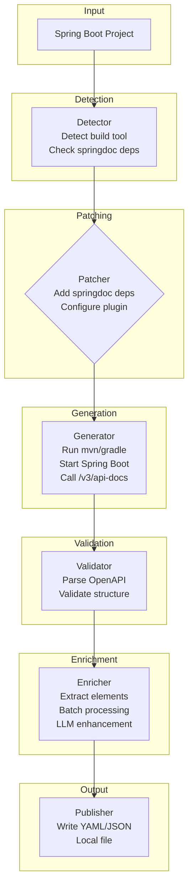
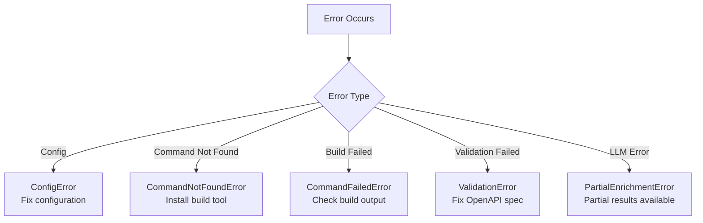

# Spec Forge Data Flow

This document describes the complete data flow through the spec-forge tool.

## Overview Diagram



## Component Details

### 1. Detector (`internal/extractor/spring/detector.go`)

**Input:** Project path

**Output:** `ProjectInfo`

**Responsibilities:**
- Detect build tool (Maven/Gradle)
- Check for springdoc dependencies
- Identify multi-module structure

```go
type ProjectInfo struct {
    BuildTool          BuildTool // Maven or Gradle
    HasSpringdocDeps   bool      // Dependencies present?
    IsMultiModule      bool      // Multi-module project?
    // ...
}
```

### 2. Patcher (`internal/extractor/spring/patcher.go`)

**Input:** `ProjectInfo`, project path

**Output:** Modified `pom.xml` or `build.gradle`

**Responsibilities:**
- Add springdoc dependencies if missing
- Configure spring-boot-maven-plugin with start/stop goals
- Support dry-run mode

**Important:** Patcher modifies build files but can restore them after generation.

### 3. Generator (`internal/extractor/spring/generator.go`)

**Input:** `ProjectInfo`, `GenerateOptions`

**Output:** `GenerateResult` (spec file path)

**Responsibilities:**
- Resolve wrapper scripts (`mvnw`/`gradlew`)
- Execute build command:
  - Maven: `mvn verify` (per springdoc docs)
  - Gradle: `gradle generateOpenApiDocs`
- Wait for Spring Boot to start and generate spec

```go
type GenerateOptions struct {
    Format     string        // "json" or "yaml"
    SkipTests  bool          // Skip tests during build
    Timeout    time.Duration // Build timeout
}

type GenerateResult struct {
    SpecFilePath string // Path to generated openapi.json
    Format       string // Output format
}
```

### 4. Validator (`internal/validator/openapi.go`)

**Input:** Spec file path

**Output:** `ValidateResult`

**Responsibilities:**
- Load OpenAPI spec using kin-openapi
- Validate structure and references
- Report validation errors

```go
type ValidateResult struct {
    Valid  bool
    Errors []string
}
```

### 5. Enricher (`internal/enricher/enricher.go`)

**Input:** OpenAPI spec, `EnrichOptions`

**Output:** Enriched OpenAPI spec

**Responsibilities:**
- Collect elements needing descriptions:
  - API operations (paths, methods)
  - API parameters (path, query, header)
  - Schema fields
- Extract context via `specctx.Extractor`
- Batch elements for LLM processing
- Apply AI-generated descriptions

```go
type EnrichOptions struct {
    Language string // "en" or "zh"
}

type Config struct {
    Provider    string        // "openai", "anthropic", "ollama", "custom"
    Model       string        // Model name
    Language    string        // Output language
    Concurrency int           // Parallel LLM calls
    Timeout     time.Duration // Request timeout
}
```

### 6. Publisher (`internal/publisher/`)

**Input:** Enriched OpenAPI spec, `PublishOptions`

**Output:** File on disk

**Responsibilities:**
- Format as YAML or JSON
- Write to specified output directory
- Preserve formatting and structure

## Error Handling



## CLI Commands Flow

| Command | Flow |
|---------|------|
| `generate` | Detect → Patch → Generate → Validate → [Enrich] → Publish → Restore |
| `enrich` | Load spec → Enrich → Publish |
| `spring patch` | Detect → Patch |
| `spring detect` | Detect |

## Configuration Priority

```
flag > env > config file > default
```

| Source | Example |
|--------|---------|
| Flag | `--provider openai` |
| Env | `LLM_PROVIDER=openai` |
| Config | `.spec-forge.yaml` |
| Default | Built-in defaults |
